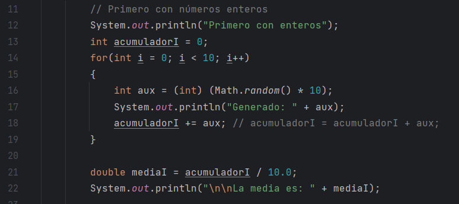
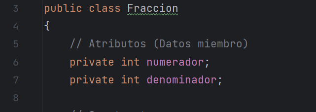
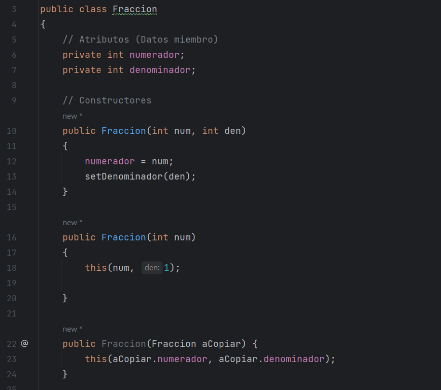
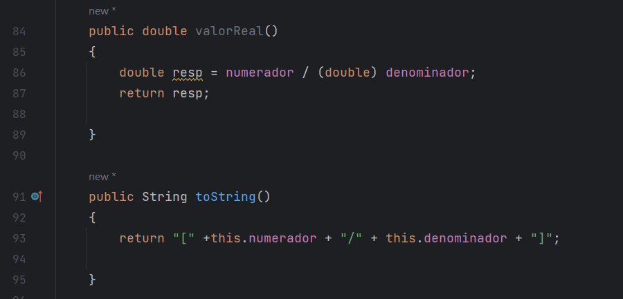
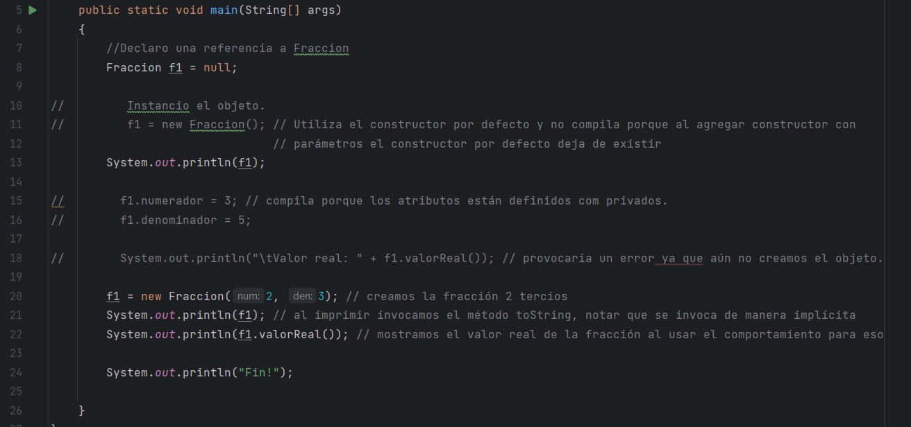
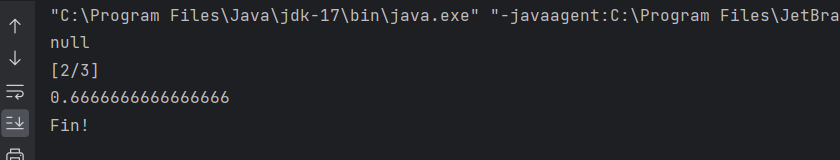
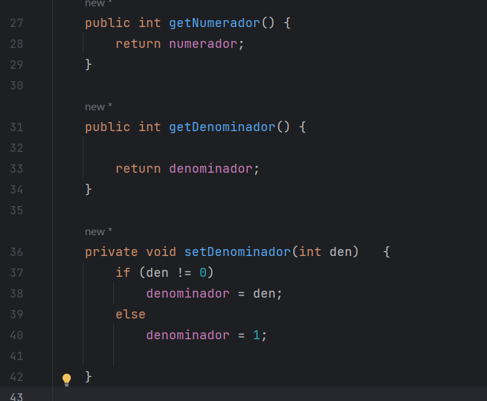
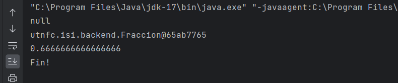
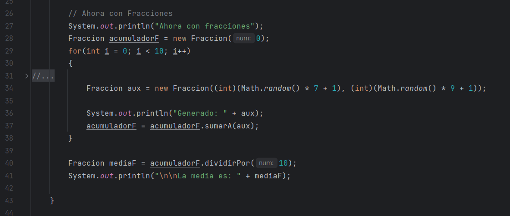

# Apunte 05 - Programación Orientada a Objetos en Java

## Introducción a POO

De la misma forma que hemos dicho que la presente asignatura no pretende ser un curso de Java, decimos ahora que tampoco es nuestro objetivo se un curso de Programación Orientada a Objetos, en el caso del Lenguaje Java ya hemos explicado que proponemos revisar los elementos fundamentales para poder implementar los elementos de backend propuestos. En el caso de Programación Orientada a Objetos, sin embargo, entendemos que es un tema ya abordado en materias anteriores o concurrentes con Backend de Aplicaciones y por lo tanto nos limitaremos a revisar las herramientas de Java para implementar la POO agregando solo algunos comentarios sobre buenas prácticas.

Lo primero que nos gustaría, mostrar en este apunte y es uno de los por qué de la POO en lo que respecta al manejo de la complejidad, para eso vamos a tomar como ejemplo guía del presente apunte el siguiente caso:

Vamos a realizar una comparación elemental de complejidad entre el cálculo del promedio  de 10 números enteros y el cálculo del promedio de 10 fracciones tratando de aproximar la complejidad a partir de las líneas de código y sin entrar en mayor detalle como sería por ejemplo un análisis de complejidad ciclomática.

Si pensamos en el código de del cálculo del promedio de 10 números aleatorios tendríamos algo como lo que sigue:

  

Es evidente que un análisis de complejidad del ejemplo anterior indicaría que el problema es trivial y prácticamente no tiene complejidad apreciable. Sin embargo, que pasaría si queremos hacer lo mismo pero con fracciones, es decir obtener la fracción (numerador / denominador) promedio de 10 fracciones (numerador / denominador) generadas con valores aleatorios. Es evidente que la complejidad sería diferente al menos en la versión básica apoyada en las herramientas elementales del lenguaje Java. Desde las simples operaciones de suma y división requeridas para el cálculo del promedio a la necesidad en el caso de las fracciones de simplificar para no obtener una fracción con números enormes.

La idea entonces es programar una clase fracción, que resuelva que permita crear objetos de tipo fracción y que resuelva las operaciones existentes ya para los números enteros en java y, de esta forma, lograr aproximar la complejidad de los problemas en esencia iguales pero que sin embargo, no son iguales como discutimos previamente.

## Primeros pasos

Para hacer eso, los lenguajes orientados a objetos (como Java) usan descriptores de entidades conocidos como _clases_. Básicamente, una _clase_ es la descripción de una entidad u objeto de forma que luego esa descripción pueda usarse para crear muchos objetos que respondan a la descripción dada. Para establecer analogías, se puede pensar que una clase se corresponde con el concepto de _tipo de dato_ de la programación estructurada tradicional, y los objetos creados a partir de la clase (llamados _instancias_ en el mundo de la _POO_) se corresponden con el concepto de _variable_ de la programación tradicional. Así como el _tipo_ es uno solo y describe la forma que tienen todas las muchas _variables_ de ese tipo, la _clase_ es única y describe la forma y el comportamiento de los muchos _objetos_ de esa clase.

Para describir objetos que responden a las mismas características de forma y comportamiento, se declara una _clase_. La definición de una clase incluye esencialmente dos elementos:

- **Atributos:** Son _variables_ que se declaran dentro de la clase, y sirven para indicar la _forma_ de cada objeto representado por esa clase. Los atributos, de alguna manera, muestran lo que cada objeto _es_, o también, lo que cada objeto _tiene_.

- **Métodos:** Son funciones, procedimientos o rutinas declaradas dentro de la clase, usados para describir el _comportamiento_ de los objetos descriptos por esa clase. Los métodos, de alguna manera, muestran lo que cada objeto _hace_.

Como sabemos, una aplicación o programa Java típico debe incluir un método especial, llamado _main()_. Ese método es el primero que se ejecuta cuando se pide lanzar la aplicación, y desde allí se administra la participación de cada _instancia_ u _objeto_ creado.

Al desarrollar una aplicación en Java, el programador creará por lo general varias clases que luego se usarán a su vez para crear objetos que trabajarán juntos. Es común en ese sentido declarar una clase cuyo único objetivo sea contener al método _main()_. En el contexto de nuestro curso, eso es lo que hemos hecho y seguiremos haciendo mediante nuestra convención de declarar una clase con el nombre _App_ o el que se convenga, para que sea ella la que contenga a _main()_. No obstante, digamos que _main()_ podría estar incluido en cualquier clase, y que incluso cada clase del proyecto podría tener un _main()_. No es obligatorio que una clase se llame _App_, y que esta deba contener a _main()_. Es sólo una convención de trabajo en el curso.

La definición de una clase en Java se hace mediante la palabra reservada _class_, seguida de un par de llaves que delimitan su contenido. Es común (pero no obligatorio) que los atributos de la clase se declaren antes que los métodos. El conjunto de atributos y métodos de una clase se conoce como el conjunto de _miembros_ de la clase. En nuestro ejemplo vamos a requerir la clase Fracción para resolver en ella los problemas asociados a una fracción, pero, que luego permita la creación de tantas fracciones concretas como haga falta en el programa:

  

Los atributos de la clase son variables, que pueden ser de tipo primitivo o pueden ser objetos de otras clases. De hecho, _String_ es una clase de Java y no un tipo primitivo, por lo cual si algún atributo de la clase _Fraccion_ fuera un _String_, tendríamos un atributo que es un objeto de otra clase, y así los objetos comienzan a colaborar entre ellos... Para la clase _Fraccion_, mínimamente sería necesario contar con un atributo que indique el numerador y otro que indique el denominador. La se vería como la que mostramos en la imagen anterior.

Uno de los principios de la POO es el llamado _Principio de Ocultamiento_, por el cual se sugiere que al definir una clase, no se permita que los atributos sean accesibles en forma directa desde el exterior de la clase, sino que se usen métodos de la misma para consultar sus valores o modificarlos. La idea detrás del _Principio de Ocultamiento_ es que el programador que use una clase predefinida no deba preocuparse por los detalles de implementación interna de la clase, sino que simplemente use los métodos que la misma provee y se maneje en un nivel de abstracción más alto. Así, si usamos objetos de la clase _String_, no debemos preocuparnos por cómo está representada esa cadena dentro del objeto. Sabemos que dentro hay una cadena implementada de alguna forma convincente, y la clase brinda todos los métodos para hacer lo que necesitemos hacer. Además, el Principio de Ocultamiento permite que la clase controle qué valores tiene cada atributo y de qué forma esos valores deberían cambiar. Si se permite el acceso a un atributo de la clase desde fuera de ella, podría provocarse que un valor incorrecto, no validado, sea asignado en ese atributo haciendo que desde allí en adelante algún proceso interno de la clase falle, por ejemplo si permitimos que el denominador de la fracción sea cero...

## Modificadores de Acceso

La forma que Java provee para que un programador obligue a respetar el Principio de Ocultamiento son los llamados _modificadores de acceso_. Se trata de ciertas palabras reservadas que colocadas delante de la declaración de un atributo o de un método de una clase, hacen que ese atributo o ese método tengan accesibilidad más amplia o menos amplia desde algún método que no esté en la clase. Así, los calificadores de acceso en Java pueden ser cuatro: _public_, _private_, _protected_, y _"default"_ (este último no es una palabra reservada: es el estado en el que queda un miembro si no se antepone ninguno de los otros tres calificadores anteriores):

- **public** : un miembro público es accesible tanto desde el interior de la clase (por sus propios métodos), como desde el exterior de la misma (por métodos de otras clases).
- **private** : sólo es accesible desde el interior de la propia clase, usando sus propios métodos.
- **protected** : aplicable en contextos de herencia (tema que veremos más adelante), hace que un miembro sea público para sus clases derivadas y para clases en el mismo paquete, pero los hace privados para el resto. !!!
- **"default"** : un miembro que no sea marcado con ningún calificador de acceso, asume estatus de acceso _por defecto_, lo cual significa que será público para clases en el mismo paquete, pero privado para el resto. Notar (otra vez) que la palabra "default" en realidad no es una palabra reservada, sino sólo el nombre del estado en que queda el miembro.

Por todo lo expresado, es que en la clase _Fraccion_ se han declarado los atributos como _private_. Entre los métodos de una clase, el más característico es el llamado método _constructor_. Un constructor es un método cuyo objetivo básico es el de inicializar los atributos de un objeto en el momento en que ese objeto o instancia se crea. Como veremos en breve, un objeto se crea en Java usando un operador del lenguaje llamado _new_, y el constructor se invoca _automáticamente_ al crear con _new_ una instancia de la clase.

Un constructor lleva el mismo nombre que la clase que lo contiene. No se debe indicar ningún tipo devuelto para él (ni siquiera _void_), y puede recibir parámetros como un método normal. Por otra parte, tanto los constructores como cualquier otro método de la clase pueden ser _sobrecargados_. Eso significa que se pueden definir _varias versiones del mismo método_. El compilador distingue entre las diversas sobrecargas de un método _por la forma de su lista de parámetros_. Por lo tanto, si un método tiene varias versiones definidas en una clase, las distintas versiones deben diferir en la cantidad de parámetros, en el tipo de los parámetros, o en ambas características. Notar que el cambio en el tipo devuelto por el método no define una nueva sobrecarga: solo las formas diversas en la lista de parámetros. En base a esto, la clase _Fracción_ podría tener este aspecto si agregamos algunos constructores:

  

Notar que en primero de los constructores la lista de parámetros está compuesta de dos números enteros, que son utilizados para inicializar el numerador y el denominador, también se puede observar que para el caso del denominador estamos usando un comportamiento propio de la clase que revisaremos en el siguiente apartado.

En el segundo caso tenemos un constructor que recibe un solo número entero y entienden en este caso la inicialización de una fracción impropia asignando en el denominador un 1. En este ejemplo también descubrimos el uso de la palabra reservada _this_ que es la referencia implícita al propio objetos para invocación de métodos y atributos, y en el caso que aquí se puede observar el llamado explicito a otro constructor. La restricción para hacer este llamado es que debe realizarse si o sí como primera línea de código de un constructor y no puede ser utilizada en ningún otro lado para invocación de constructores.

Finalmente la tercera sobrecarga del constructor recibe como parámetro un objeto de la clase Fracción y provoca una nueva facción con los mismos valores de numerador y denominador que la fracción dada. En el apartado siguiente veremos la utilidad de este constructor y su necesidad para sortear la situación de la asignación de referencias, más allá de que en java el proceso correcto para provocar esta copia se denomina clonación y será analizado en clases posteriores.

Ahora bien, ahora tenemos una clase que es capaz de contener los datos del numerador y denominador de una fracción pero no tenemos aún una razón de ser para la misma, es decir no tenemos ningún método que provoque un comportamiento real, es decir que sea capaz de responder a un mensaje propio del concepto de una fracción.

Vamos a agregar 2 métodos extra en la clase _Fraccion_ antes de comenzar a utilizar objetos de tipo fracción, por un lado el comportamiento más elemental de cualquier fracción que es devolver el valor real de la relación y en segundo lugar un comportamiento que como veremos más adelante toda clase java puede implementar para transformar la instancia de un objeto de la clase en una cadena de caracteres. Con estos métodos nuestra clase Fracción agregaría:

  

## Referencias y Creación de Objetos

Así como está definida, la clase _Fraccion_ está todavía muy incompleta pero ya puede usarse para crear objetos y mostrar la forma básica de usar un constructor. Supongamos entonces que se quieren crear dos o tres objetos de la clase _Fraccion_ para comenzar a trabajar con ellos. El método _main()_ de nuestra clase _App_ podría hacerlo:

  

Note el uso del operador _new_ para crear los objetos: ese operador crea un objeto de la clase que se le indique, cada vez que se lo usa. Pero en cada creación, _new_ llama a algún constructor que figure en la clase del objeto que se pide crear, y la decisión de cuál constructor llamar depende de la lista de parámetros actuales que se pase a ese constructor al invocarlo: puede verse que al crear el objeto _f1_, se está invocando al primero de los constructores pues la lista de parámetros actuales es de dos números enteros.

En síntesis: el primer _new_ crea un objeto que será manejado por la variable _f1_, y en ese objeto los atributos _numerador_ y _denominador_ quedan valiendo los valores { 2, 3} respectivamente.

Una vez que se han creado objetos de una clase (por ejemplo, lo que vimos en el método _main()_), estos objetos pueden comenzar a _invocar métodos_ para que se apliquen sobre sus atributos. La forma de hacerlo, consiste en usar la variable que maneja al objeto y _colocar luego de ella un punto_, _seguido del nombre del método_ que se quiere invocar para ese objeto como podemos observar al utilizar el método valorReal de la fracción referenciada por _f1_.

Se dice que el objeto desde el cual se invoca al método está _llamando_ al método, o también se dice que a ese objeto se le está _pasando un mensaje_. En el ejemplo, el objeto _f1_ está llamando al método _valorReal()_ (o también decimos que _f1_ recibe el mensaje de retornar su valor real). La salida del ejemplo anterior sería:

  

## Métodos de acceso de lectura y escritura

Sigamos entonces con la clase _Fraccion_. Si los atributos de una clase se definen privados, entonces la clase puede proveer métodos que permitan el acceso al valor de esos atributos, tanto para consultar su valor como para modificarlo (si es decisión del programador de la clase permitir esas operaciones) notar que al implementar estos métodos estamos diseñando el comportamiento de la clase. Por ejemplo en la clase fracción no podemos permitir que se modifiquen de manera independiente el numerador o el denominador puesto que al modificar uno y solo uno de los atributos en realidad estaríamos en presencia de una nueva fracción y por lo tanto de un nuevo objeto aunque estos es conceptual.

La especificación de Java Beans en Java define que para esos métodos intervengan las palabras "get" (para los métodos de consulta) y "set" para los métodos modificadores, junto al nombre del atributo al que se quiere proveer acceso con la primera letra en mayúscula. Así, si un atributo se llama "clave", el método de consulta para el mismo podría llamarse "_getClave()_" y el modificador "_setClave()_". En la clase _Fraccion_, incluimos ahora este conjunto de _métodos de acceso_.

  

Note que los métodos de consulta de la clase se ha marcado como _public_ (incluso los constructores). Esto es consecuencia directa de respetar el _Principio de Ocultamiento_, que en última instancia aconseja declarar privados a los atributos y públicos a los métodos de una clase. Los métodos de acceso son muy sencillos: cada uno de los métodos tipo _get_ retorna el valor del atributo con el cual se asocia, el método tipo _setDenominador_ cambia el valor de ese atributo teniendo en cuenta el control a realizar. No hemos implementado el método setNumerador ya sería privado al igual que _setDenominador_ y que no hay control necesario y podemos desde dentro de la clase acceder directamente al atributo. Cabe aclarar que en algunos equipos se conviene en programar siempre todos los métodos set aunque no cumplan función alguna y solo para mantener coherencia.

Finalmente, digamos que toda clase Java en última instancia hereda o se define a partir de otra muy general llamada _Object_, la cual provee ya definidos una serie de métodos elementales. Varios de esos métodos se usan tal como vienen desde _Object_, pero algunos deberían ser redefinidos por cada clase. El método _toString()_ es uno de ellos, y se usa para retornar una cadena de caracteres con el contenido del objeto invocante, de forma que sea adecuadamente visualizable en un dispositivo de salida. Si no se redefine, el método _toString()_ retorna una cadena con el nombre de la clase a la cual pertenece el objeto, más la dirección de memoria de ese objeto en formato hexadecimal. En general, nuestras clases deberían contar con una versión propia del método _toString()_, lo cual es normalmente fácil de hacer. Mostramos la clase _Fraccion_ completa con ese método incluido al final

El método _toString()_ es muy especial en Java. El lenguaje asume _automáticamente_ que se está invocando a ese método en cualquier contexto en el cual se use un objeto pero se requiera una conversión a _String_ del mismo. Eso significa que la línea:

`System.out.println("Fracción f1: " + f1.toString());`

también puede escribirse así, y el resultado es exactamente el mismo:

`System.out.println("Fracción f1: " + f1);`

Pero aún menos intuitivo es lo que pasa si en la clase fracción comentamos el método toString o le cambiamos el nombre de alguna forma. La salida anterior pasaría a ser como sigue:

  

Lo que está pasando aquí es que al cambiar el nombre del método en la clase Fracción el método toString que está usando java para obtener la versión de cadena de carecteres del objeto es el existente en la clase Object y por lo tanto muestra solo los elementos disponibles dentro de la clase object que son el nombre de la clase y la dirección de memoria de la referencia.

## Volviendo al promedio de 10 fracciones

Bueno, habiendo llegado hasta aquí tenemos nuestra clase Fracción con los métodos que ya hemos analizado y solo nos resta agregar los demás métodos a la clase para permitir que una fracción se pueda sumar, restar, multiplicar o dividir por otra fracción además de la posibilidad de simplificarse. La versión de fracción que acompaña el presente material ya tiene estos métodos implementados.

Ahora nos proponemos analizar la complejidad del problema planteado al inicio pero contando con la clase Fracción creada:

  

Como podemos observar fuera de la necesidad de 2 números aleatorios en lugar de uno para la creación de cada fracción la complejidad entre este fragmento y el inicial asociado números enteros es similar puesto que ya hemos resuelto las problemáticas específicas de las fracciones dentro de la clase fracción.

## Objetos en base a Objetos

Acompañando este apunte además del ejemplo de fracciones que hemos analizado, agreamos un ejemplo más donde unos objetos se crean en base a otros objetos más simples, vale su análisis para comprender el manejo de la complejidad por capas que es lo que en general se persigue cuando realizamos diseños orientados a objetos.
