# Apunte 06 - Vectores y Manejo de Excepciones

## Arreglos en Java

La estructura de datos nativa de Java es la que se conoce como arreglo unidimensional o vector. Se trata de una colección de valores que deben ser del mismo tipo y que se organiza de tal forma que cada valor o componente individual es identificado automáticamente por un número designado como índice. El uso de los índices permite el acceso y posterior uso de cada componente en forma individual.

La cantidad de índices que se requieren para acceder a un elemento individual, se llama dimensión del arreglo. Los arreglos unidimensionales se denominan así porque solo requieren un índice para acceder a un componente. Por otra parte, dada la similitud que existe entre el concepto de arreglo unidimensional y el concepto de vector en Algebra, se suele llamar también vectores a los arreglos unidimensionales.

El siguiente gráfico muestra la forma conceptual de entender un arreglo unidimensional. Se supone que la variable arreglo se denomina v y que la misma está dividida en seis casilleros, de forma que en cada casillero puede guardarse un valor. Se supone también que el tipo de valor que puede guardarse en el arreglo v del ejemplo, es int.  

Observar que cada casillero es automáticamente numerado con índices, los cuales en Java comienzan siempre a partir del cero: la primera casilla del arreglo siempre está relacionada con el subíndice con el valor cero, en forma automática. A partir del índice, cada elemento del arreglo v puede accederse en forma individual usando el identificador del componente: se escribe el nombre del arreglo, luego un par de corchetes, y entre los corchetes el valor del índice de la casilla que se quiere acceder.  En ese sentido, el identificador del componente cuyo índice es 2, resulta ser v[ 2 ]:

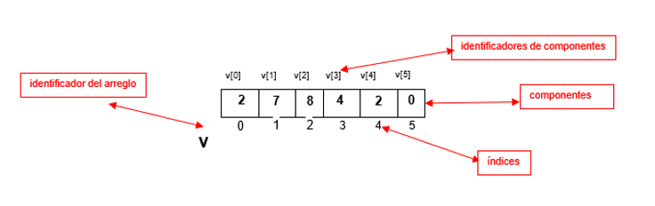  

Para declarar una variable de tipo arreglo en Java, hay que recordar primero que en Java los arreglos de cualquier dimensión son objetos, y por lo tanto deben ser creados con el operador new. Lo primero es declarar entonces una referencia con la cual se va a apuntar al arreglo que se quiere crear. En Java, esto se hace escribiendo el tipo de valor que se almacenará en el arreglo (ese tipo se conoce como el tipo base del arreglo), luego el nombre del arreglo y finalmente un par de corchetes vacíos:

```java
        int[] v;

```

Al declarar una referencia de tipo arreglo, lo que se está haciendo es declarar una variable que luego será capaz de contener la dirección de memoria de un arreglo. El valor inicial de esa referencia es null, y el arreglo aún no existe en memoria:

Luego se usa el operador new para crear el objeto arreglo: se escribe new, seguido nuevamente del tipo base del arreglo, y otra vez el par de corchetes pero de forma que esta vez, se escribe dentro de ellos el tamaño del arreglo que se quiere crear:

```java
        int[] v = new int[6];

```

La instrucción anterior crea un arreglo de seis componentes capaces de almacenar cada uno un valor int, inicializa en cero cada casilla de ese arreglo, y retorna la dirección del mismo (que en este caso se almacena en la referencia v que declaramos antes):

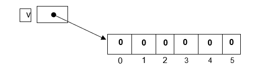  

Observar que si el tamaño de un arreglo es 6, entonces la última casilla del mismo lleva el índice 5 debido a que los índices comienzan siempre desde el 0. En un arreglo en Java, no existe una casilla cuyo índice coincida con el tamaño del arreglo.

Una vez que se creó el arreglo con new, se usa la referencia que lo apunta para acceder a sus componentes, colocando a la derecha de ella un par de corchetes y el índice del valor que se quiere acceder. Los siguientes son ejemplos de las operaciones que pueden hacerse con los componentes de un arreglo (tomamos como modelo el arreglo v anteriormente creado):

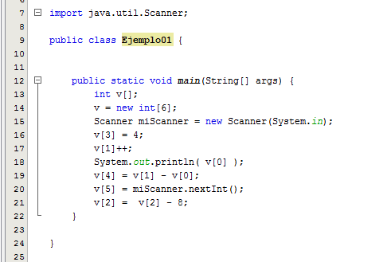  

Si se desea procesar un arreglo de forma que la misma operación se efectúe sobre cada uno de sus componentes, es normal usar un ciclo for, de forma se aproveche la variable de control del ciclo como índice para entrar a cada componente. Los siguientes esquemas muestran la forma de hacer una carga por teclado y una visualización por pantalla de un arreglo de seis componentes de tipo int:

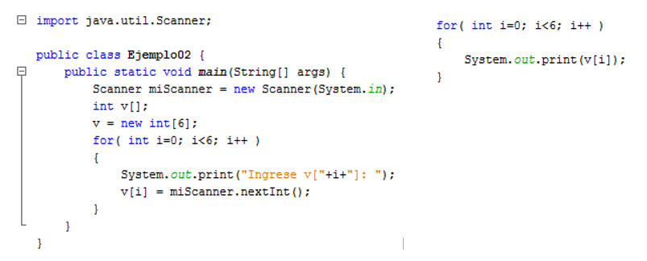  

Un detalle interesante es que todo objeto arreglo en Java provee un atributo llamado length, que contiene el tamaño del arreglo tal como fue declarado al crear ese arreglo con new. Ese atributo es de naturaleza pública (public), por lo que puede accederse directamente mediante el identificador de la variable referencia que apunta al arreglo. Los dos ciclos anteriores, podrían escribirse así:

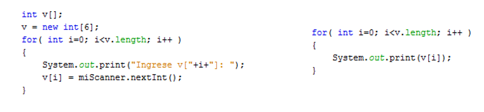  

## Creación y uso de matrices

Básicamente, un arreglo bidimensional o matriz es un arreglo cuyos elementos están dispuestos en forma de tabla, con varias filas y columnas. Aquí llamamos filas a las disposiciones horizontales del arreglo, y columnas a las disposiciones verticales.

Para entrar a un componente, debe darse el índice de la fila del mismo y también el índice de la columna. Como los índices requeridos son dos, el arreglo es de dimensión dos. El siguiente esquema ilustra la manera de declarar y crear un arreglo bidimensional de componentes int en Java, la forma conceptual de representarlo, y la manera de acceder a sus componentes:

```java
        int a [][];  // se declara una referencia al arreglo, con valor inicial null.
        a = new int [ 6 ][ 4 ];  // se crea el arreglo, con 6 filas y 4 columnas.
        a[2][3] = 5;  // se accede a una casilla y se asigna un valor en ella.


```

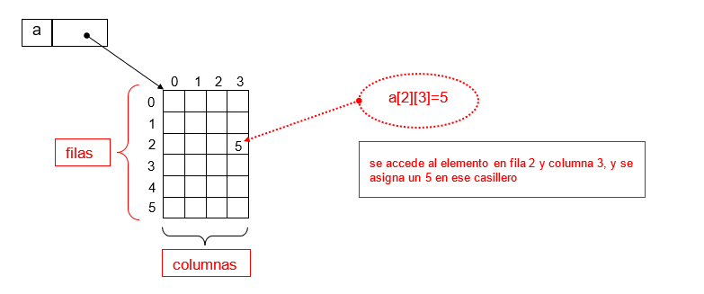  

Para declarar la referencia al arreglo se usan ahora dos pares de corchetes vacíos. Y para crear el arreglo con new, en el primer par de corchetes se escribe la cantidad de filas que se necesitan y en el segundo par se escribe la cantidad de columnas.

Observar que para acceder a un elemento, se coloca el nombre de la referencia al arreglo, luego el número de la fila del elemento que se quiere acceder, pero encerrado entre corchetes, y por último el número de la columna de ese elemento, también encerrado entre corchetes.   Notar además, que en el lenguaje Java los arreglos de cualquier dimensión están basados en cero, lo cual significa que el primer índice de cada dimensión es siempre cero. En la figura anterior, puede verse que el arreglo tiene seis filas, pero numeradas del 0 (cero) al 5 (cinco), y cuatro columnas, numeradas del 0 (cero) al 3 (tres). No hay excepciones a esta regla, por lo cual debe tenerse cuidado de ajustar correctamente los ciclos para procesamiento de arreglos.

Para cargar por teclado una matriz a de n filas y m columnas (y en general, para procesar de forma secuencial una matriz), se pueden usar dos ciclos for anidados, de forma que el primero recorra las filas de la matriz, y el segundo las columnas: 

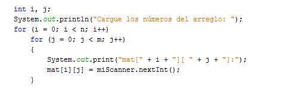  

La idea básica del proceso aquí definido es que la variable i del ciclo más externo se usa para indicar qué fila se está procesando en cada vuelta. Dado un valor de i, se dispara otro ciclo controlado por j, cuyo objetivo es el de recorrer todas las columnas de la fila indicada por i. Notar que mientras avanza el ciclo controlado por j permanece fijo el valor de i. Sólo cuando corta el ciclo en j, se retorna al ciclo en i, cambiando ésta de valor y comenzando por ello con una nueva fila. El proceso de recorrer de forma secuencial una matriz avanzando fila por fila empezando desde la cero, como aquí se describe, se denomina recorrido en orden de fila creciente.

Se pueden hacer recorridos de otros tipos si fuera necesario, simplemente cambiando el orden de los ciclos. Por ejemplo, el siguiente esquema realiza un recorrido en orden de fila decreciente: comienza con la última fila, y barre cada fila hacia atrás hasta llegar a la fila cero.

Si se desea un recorrido en orden de columna creciente (o decreciente), sólo deben invertirse los ciclos: el ciclo en j debe ir por fuera, y el ciclo en i debe ir por dentro. De esta forma, el valor de j no cambia hasta que el ciclo en i termine todo su recorrido. Sin embargo, no debe olvidarse que si queremos que j indique una columna, entonces j debe usarse en el segundo par de corchetes al acceder a la matriz. Y si la variable i va a indicar filas, entonces debe usarse en el primer par de corchetes. Esto es independiente del orden en que se presenten los ciclos para hacer cada recorrido:

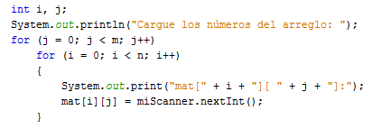  

La variable que indica la fila va en el primer par de corchetes, y la variable que indica la columna va en el segundo, sin importar cuál ciclo va por fuera y cuál por dentro.

## Manejo de Excepciones en Java

En Java, un error en tiempo de ejecución provocado por circunstancias anormales (errores matemáticos, índices fuera de rango, casting imposible de realizar, puntero nulo invocando a un método, etc.) se representa como un objeto. Así como la JVM crea  automáticamente objetos que representan a los eventos producidos por el usuario sobre los componentes de la interfaz visual de usuario, también genera automáticamente objetos que representan a un error en tiempo de ejecución, permitiendo que el programador pueda (si lo desea) intervenir en esa situación y eventualmente recuperarse de ella, incluso sin que la aplicación finalice de forma abrupta. Esos objetos que representan errores de ejecución se llaman objetos de excepción o simplemente excepciones y forman parte de una jerarquía de clases cuya clase base es la clase Throwable (o sea: "que puede ser lanzada").

Si bien aún no hemos tratado aquí la forma de implementar Herencia en Java el principio de Herencia de la POO es conocido por los alumnos de materias anteriores y por lo tanto es podemos revisar esta jerarquía:

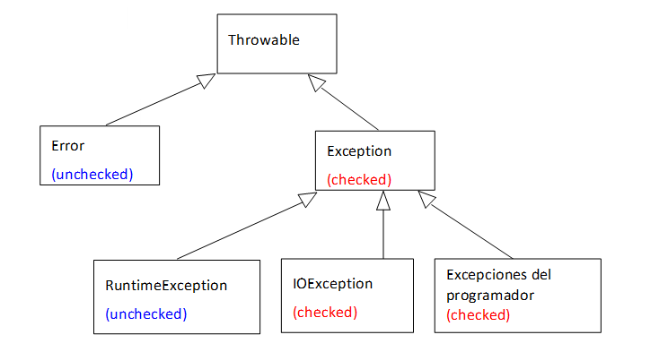  

Los errores representados por la clase Error son errores graves de hardware o de sistema frente a los cuales no se espera que el programador pueda hacer nada más que darse por notificado del hecho. Son manejados automáticamente por la JVM. Los errores  representados por la clase Exception son errores comunes de programación, algunos más graves que otros, que pueden requerir que el programador se vea obligado a escribir código de respuesta para esas excepciones, pues de lo contrario el programa no compilará. En ese sentido, las excepciones pueden clasificarse en chequeadas (checked) y en no chequeadas (unchecked). El gráfico anterior muestra cuáles son de cada tipo.

Si un segmento de código puede llegar a lanzar una excepción del tipo checked, entonces el compilador obliga a que el programador tenga eso en cuenta, escribiendo código para tratar esa posible excepción, aunque luego en la práctica la misma no llegue a lanzarse.

En general, todas las clases de excepción que derivan de la clase Exception son chequeadas (salvo las que derivan a su vez de la clase RuntimeException). Por ejemplo, las excepciones de IO que pueden producirse al trabajar con entrada de datos desde distintos dispositivos, derivan todas de la clase IOException, que a su vez baja desde Exception, y todas ellas son chequeadas: debemos escribir código para tratar las posibles excepciones de IO provocadas por nuestro código.

Si la excepción es no chequeada, el compilador no obliga a escribir código alguno de respuesta, y es decisión del programador el hacerlo o no. Todas las clases de excepción derivadas desde RuntimeException son no chequeadas, y también la clase Error. Si el programador no incluye ningún código de tratamiento para estas clases de excepciones y alguna llega a producirse, simplemente el programa o el método finalizará mostrando un mensaje de error acorde a la excepción producida, pero no habrá problemas de compilación previa. Algunas de las clases de excepción más comunes derivadas de RuntimeException y de IOException son las siguientes:

- Derivadas más comunes de RuntimeException:
  - NullPointerException
  - ArithmeticException
  - IndexOutBoundsException
  - NegativeArraySizeException

- Derivadas más comunes de IOException:
  - EOFException
  - FileNotFoundException
  - InterruptedIOException
  - ObjectStreamException

Existen dos formas básicas de responder a una excepción (o sea: hay dos formas básicas de código preventivo contra esa excepción). Si la excepción es chequeada, el programador está obligado a decidirse por alguna de las dos que indicaremos. Si la excepción es no chequeada, el programador puede optar por no usar ninguna y simplemente ignorarla, o puede tratarla con cualquiera de las dos formas, tratar la excepción o informar su existencia posible.

### Tratamiento de Excepciones

La forma más natural de tratar una excepción (sobre todo si es chequeada), consiste en capturarla con un bloque try – catch, en dicho bloque se comprueba si una excepción se ha producido, y actuar en consecuencia. Para ello se utilizan las palabras reservadas try, catch y finally.

El bloque try tiene que ir seguido, al menos, por una cláusula catch o una cláusula finally.
La sintaxis general del bloque try consiste en la palabra clave try y una o más sentencias entre llaves.

```java
        try {
            // Sentencias Java
        }
        catch (UnTipoTrhowable nombreVariable) {
            // Sentencias Java
        }
        finally {
            // Sentencias Java
        }

```

Puede haber más de una sentencia que genere excepciones, en cuyo caso habría que proporcionar un bloque try para cada una de ellas. Algunas sentencias, en especial aquellas que invocan a otros métodos, pueden lanzar, potencialmente, muchos tipos diferentes de excepciones, por lo que un bloque try consistente en una sola sentencia requeriría varios controladores de excepciones.

También se puede dar el caso contrario, en que todas las sentencias, o varias de ellas, que puedan lanzar excepciones, se encuentren en un único bloque try, con lo que habría que asociar múltiples controladores a ese bloque. Aquí la experiencia del programador es la que cuenta y es el propio programador el que debe decidir qué opción tomar en cada caso.
Los controladores de excepciones deben colocarse inmediatamente después del bloque try. Si se produce una excepción dentro del bloque try, esa excepción será manejada por el controlador que esté asociado con el bloque try.

Cuando se produce la excepción, el código que se ejecuta es el que está en el bloque de catch. Es como si dijésemos "controlo cualquier excepción que coincida con mi argumento". El argumento de la sentencia declara el tipo de excepción que el controlador, el bloque catch, va a manejar.

En este bloque tendremos que asegurarnos de colocar código que no genere excepciones. Se pueden colocar sentencias catch sucesivas, cada una controlando una excepción diferente. No debería intentarse capturar todas las excepciones con una sola cláusula, como esta:

```java
        catch( Excepcion e ) { //...

```

Esto representaría un uso demasiado general, podrían llegar muchas más excepciones de las esperadas. En este caso es mejor dejar que la excepción se propague hacia arriba y dar un mensaje de error al usuario. La cláusula catch comprueba los argumentos en el mismo orden en que aparezcan en el programa. Si hay alguno que coincida, se ejecuta el bloque.

Cuando se colocan varios controladores de excepción, es decir, varias sentencias catch, el orden en que aparecen en el programa es importante, especialmente si alguno de los controladores engloba a otros en el árbol de jerarquía. Se deben colocar primero los controladores que manejen las excepciones más alejadas en el árbol de jerarquía, porque de otro modo, estas excepciones podrían no llegar a tratarse si son recogidas por un controlador más general colocado anteriormente.

Por lo tanto, los controladores de excepciones que se pueden escribir en Java son más o menos especializados, dependiendo del tipo de excepciones que traten. Es decir, se puede escribir un controlador que maneje cualquier clase que herede de Throwable; si se escribe para una clase que no tiene subclases, se estará implementando un controlador especializado, ya que solamente podrá manejar excepciones de ese tipo; pero, si se escribe un controlador para una clase nodo, que tiene más subclases, se estará implementando un controlador más general, ya que podrá manejar excepciones del tipo de la clase nodo y de sus subclases.

Por último el bloque finally, es el bloque de código que se ejecuta siempre, haya o no excepción. Por ejemplo, podría servir para hacer un log o un seguimiento de lo que está pasando, porque como se ejecuta siempre puede dejar grabado si se producen excepciones y si el programa se ha recuperado de ellas o no. Este bloque finally puede ser útil cuando no hay ninguna excepción. Es un trozo de código que se ejecuta independientemente de lo que se haga en el bloque try.

A la hora de tratar una excepción, se plantea el problema de qué acciones se van a tomar. En la mayoría de los casos, bastará con presentar una indicación de error al usuario y un mensaje avisándole de que se ha producido un error y que decida si quiere o no continuar con la ejecución del programa.

A continuación mostramos el uso del bloque try-catch con un ejemplo que permite leer un carácter desde teclado y comprueba que se ingrese el tipo correcto, utilizando el método read del paquete System.in para leer el carácter:

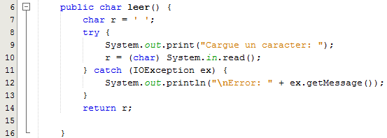  

Si el bloque encerrado entre las llaves de try llega a disparar una excepción de tipo IOException, automáticamente la JVM creará un objeto de esa clase y buscará el bloque catch que tenga un parámetro IOException. Si lo encuentra, pasará el objeto creado a ese bloque, y se ejecutará el código encerrado entre las llaves de catch. Luego de ello, el programa seguirá ejecutando las instrucciones que se encuentran debajo del bloque catch (a menos que dentro del catch se haya lanzado un System.exit()). Como se ve, no necesariamente el programa termina si una excepción se produce y la misma es capturada. La decisión de terminarlo es del programador.

El objeto generado por la JVM para representar la excepción dispone de una serie de métodos que permiten que el programador tenga mayor conocimiento del error producido. Uno de esos métodos es getMessage() (heredado desde Throwable) que retorna un String con una descripción del error que provocó la excepción. El mismo puede usarse para mostrar un mensaje más claro.

Como mencionamos anteriormente, si el bloque try puede llegar a lanzar excepciones de varias clases diferentes (aunque obviamente, sólo una en un momento dado), se pueden escribir varios bloques catch, cada uno con un parámetro que represente a la excepción esperada. Sólo debe tenerse en cuenta que la JVM recorre las definiciones catch por orden de escritura en el código, y al primero cuyo parámetro coincida con la excepción generada (incluidas las referencias polimórficas), lo aceptará. Por lo tanto, escriba los diversos catch comenzando por los menos polimórficos, y siga con los más polimórficos a continuación (de otro modo, no compilará...) El siguiente ejemplo muestra la forma correcta de hacerlo: El primer catch tiene un parámetro IOException, y el segundo uno de tipo Exception. Por lo tanto, este último debe escribirse al final:

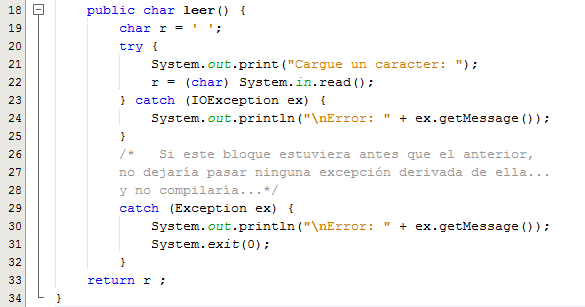  

Note que cuando una excepción se captura y procesa con un bloque try – catch, entonces el lanzamiento de una excepción en el bloque try provocará que la ejecución de la secuencia dentro del try se interrumpa, y se traslade el flujo de ejecución al catch que corresponda. Por el contrario, si el try se ejecuta en forma normal, entonces ningún bloque catch se ejecutará. Esto puede provocar que en determinadas circunstancias el programa no ejecute ciertas instrucciones críticas (por ejemplo, el cierre de un archivo o de una base de datos, o la liberación de recursos gráficos): si esas instrucciones están en el bloque try y se dispara una excepción antes de ejecutarlas, o están en un catch pero no se produce una excepción, entonces las instrucciones críticas no serán ejecutadas nunca.

Se pueden producir casos donde se estén manipulando archivos, los cuales necesitan cerrarse para cerrar el flujo con el archivo físico, si el cierre del mismo se coloca dentro del bloque try y durante la ejecución del try se produce una excepción, se interrumpirá el try y el archivo podría llegar a no cerrarse. Esto puede ser un gran problema si se supone que el programa continúa en ejecución.

En casos así, se puede usar un bloque finally para complementar el try – catch. Un bloque finally se asemeja a un catch(), salvo por el hecho de que no se particulariza para un tipo específico de excepción, y por el hecho de que un bloque finally siempre se ejecuta: si el bloque try se ejecuta sin problemas, entonces al finalizar el mismo se ejecutará el bloque finally, y si el try se interrumpe se activará un catch(), pero al terminar de ejecutarse ese catch() se ejecutará de todos modos el finally. El siguiente esquema muestra una forma correcta de solucionar nuestro problema del cierre del archivo:

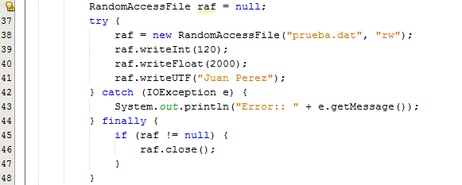  

Debe notar que el bloque finally será ejecutado prácticamente en toda combinación de situaciones que afecten al bloque try – catch. La única situación en la que finally no se ejecutará es aquella en la cual se ejecuta un System.exit() en el try o en el catch() (en casos así, la invocación a exit() provoca que el programa se interrumpa de inmediato, sin llegar a ejecutar ninguna otra instrucción).

### Try with resources (Try con recursos)

Para terminar esta sección, digamos brevemente que a partir de la versión 7 de Java se introdujo una nueva variante en cuanto a la posibilidad de escribir un bloque try,  que se conoce como "try con recursos" (o "try with resources") Se trata de un bloque try en el cual se declaran en forma especial ciertos recursos. Esos recursos son objetos que deben ser cerrados al terminar el programa (como en el caso del ejemplo que hemos mostrado hasta aquí). El bloque try with resources garantiza que esos recursos serán efectivamente cerrados (en forma automática) al terminar de ejecutarse el bloque try. Técnicamente, los recursos declarados en un try with resources son objetos de cualquier clase que implemente la interface java.lang.AutoCloseable o su derivada java.lang.Closeable y el único método que estas declaran es justamente el método close().

A modo de ejemplo de uso, volvamos sobre el ejemplo que hemos mostrado para abrir, grabar y cerrar un RandomAccessFile. En el último esquema hemos visto que toda la operación podría escribirse con un try – catch – finally sin problemas. Pero alternativamente, a partir de Java 7, podemos hacer en forma más compacta la misma operación mediante un try with resources:

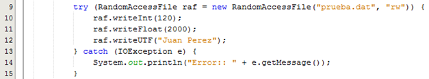  

En el ejemplo anterior mostramos el uso de un try with resources. El recurso asociado al bloque try se declara entre paréntesis inmediatamente luego de la palabra try. En nuestro caso se trata de un objeto de la clase RandomAccessFile (que implementa AutoCloseable, como todas las clases de gestión de archivos y flujos externos en Java). Tanto si el try se ejecuta sin problemas, como si el try provoca una excepción, el archivo representado por raf será cerrado automáticamente al terminar de ejecutarse el try o el catch (lo cual como primera ventaja, simplifica el bloque al no tener que escribir un finally explícito sólo para el cierre del archivo).

Note que un try with resources puede incluir bloques catch y finally en forma normal y cualquier bloque catch o finally será ejecutado después que el recurso asociado haya sido automáticamente cerrado.

## Throws (avisando posible ocurrencia de excepciones)

La palabra clave throws se utiliza para identificar la lista posible de excepciones que un método puede lanzar. Si un método es capaz de provocar una excepción que no maneja él mismo, debería especificar este comportamiento, para que todos los métodos que lo llamen puedan colocar protecciones frente a esa excepción. Para la mayoría de las subclases de la clase Exception, el compilador Java obliga a declarar qué tipos podrá lanzar un método. Si el tipo de excepción es Error o RuntimeException, o cualquiera de sus subclases, no se aplica esta regla, dado que no se espera que se produzcan como resultado del funcionamiento normal del programa. Si un método lanza explícitamente una instancia de Exception o de sus subclases, a excepción de la excepción de runtime, se debe declarar su tipo con la sentencia throws. La declaración del método sigue ahora la sintaxis siguiente:

```java
    tipo nombreMetodo( argumentos ) throws excepciones { }

```

Lo más sencillo, es simplemente declarar la posibilidad de lanzamiento de la excepción en la cabecera del método que posea el bloque de código inseguro.
A continuación mostramos el mismo ejemplo del punto anterior, pero haciendo que el método leer explicite la excepción a manejar:

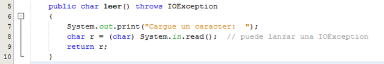  

Si el código inseguro pudiera lanzar más de un tipo de excepción, se pueden declarar todas en la cabecera: 

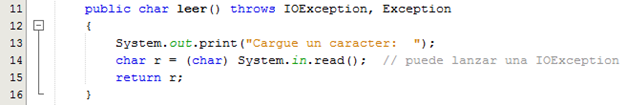  

Lo anterior hace que el programador obligue a quien invoque al método leer() a tratar a su vez la excepción lanzada por él. En otras palabras, el programador de leer() se "saca el problema de encima" y lo transfiere a su "cliente".

En el ejemplo, para poder usar el método leer hay que escribir el siguiente código:

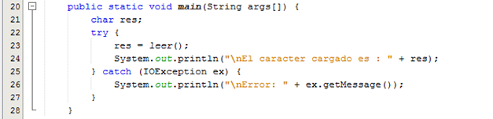  

Si no se encierra la invocación del método leer() en un bloque try catch, el compilador informará del error.

## Provocar excepciones `throw`

La sentencia throw se utiliza para lanzar explícitamente una excepción. En primer lugar se debe obtener un descriptor de un objeto Throwable, bien mediante un parámetro en una cláusula catch o, se puede crear utilizando el operador new. La forma general de la sentencia throw es:

```java
        throw objetoThrowable;

```

El flujo de la ejecución se detiene inmediatamente después de la sentencia throw, y nunca se llega a la sentencia siguiente. Se inspecciona el bloque try que la engloba más cercano, para ver si tiene la cláusula catch cuyo tipo coincide con el del objeto o instancia Thorwable. Si se encuentra, el control se transfiere a esa sentencia. Si no, se inspecciona el siguiente bloque try que la engloba, y así sucesivamente, hasta que el gestor de excepciones más externo detiene el programa y saca por pantalla el trazado de lo que hay en la pila hasta que se alcanzó la sentencia throw.

En el programa siguiente, se muestra como se hace el lanzamiento de una nueva instancia de una excepción, en este caso una excepción de ArithmeticException, cuando encuentra que el posible divisor tiene el valor de 0:

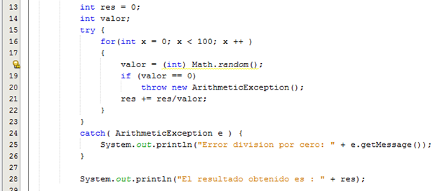  

## Por donde seguimos

Si bien en este apunte hemos revisado algunos conceptos del lenguaje de programación java como el uso de estructuras de datos nativas como los vectores y las matrices o las herramientas para manejar las excepciones o las situaciones no deseadas, lejos estamos aún de lograr componer con estas herramientas lógica de backend.

A priori los próximos pasos serían lograr procesar archivos de datos con estructuras puntuales manejando esos datos en objetos para lograr disponer de ellos en los procesos necesarios.

Por otro lado si bien los vectores son estructuras de datos potentes en general, en Java existe todo un Framework de colecciones que implementan herramientas más potentes y flexibles para construir nuestros programas con estructuras de datos y finalmente revisar los demás elementos de la programación orientada a objetos y su implementación en Java, ambos temas que abordaremos en la próxima semana.